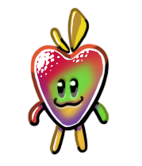

# vTuberry

## What is this?

**vTuberry** is a minimalist tool that uses web technologies to manage and display PNGtubers.  
It’s focused on a simple, lightweight and easy to setup solution for everyone to use.

## This software already exist, I know _XXX_ that does the same thing!

It’s not a replacement of any existing tool, actually there’s plenty others that exist and are better at doing it: [Honk](https://dreamtoaster.itch.io/honk), [Veadotube](https://veado.tube/), [PNGTube](https://github.com/sugoidogo/PNGTube)…

Unlike the other tools, **vTuberry** relies on the HTML5 canvas element and the WebAudioAPI. It enables a wider range of effects while still being fairly light to process for the majority of the hardware, and it runs inside your browser.

## How does it work?

If you are using OBS, you can make a browser source and link to the url of the web hosted file _(to come)_.

If you are using another capture tool, you can download the `index.html` file and open it in your favorite browser. Then you can capture your window and apply a choma key to separate your avatar from the green background.

You have to click the button on the page to grant permission to use your microphone.

## Who made this?

I, Crazyrems, am the only creator of this piece of software _(so far)_, including Melon the mascot. She’s a combination of a strawberry and an apple.

## Is it open source? Can I fork it and make changes? Can I make pull requests?

This program is not yet ready for open source. It’s still in a very early development phase and I want a minimal feature set before making it ready for open source.

If you want to contribute, go on, I can’t tell you what to do but be aware that a lot of things may change until the first alpha.

## What’s next?

I plan to add a few more features, here are some of them _(in no particular order)_:

- Import images from the settings,
- Adjust mic levels and response curve,
- JSON settings import and export,
- More animations, blinking, phonemes.
